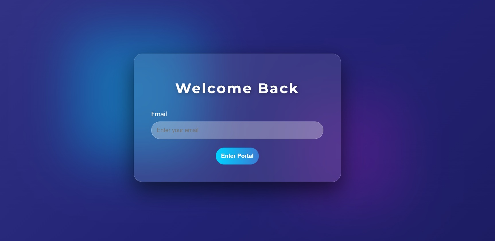

Aurora Login Portal
---
### 1. Project Brief

This is a modern responsive login interface designed for seamless user authentification with a high end visual austhetic.

### 2. Business Rationale

In a digital-first environment, the login page is the first point of interraction for users. This project addresses to primary business needs.

- User Trust: High end visual aesthetics like glassmorphism and smooth animations establish the platform as premium, modern provider.
- Reduced friction: A clean centered layout with high contrast inputs ensures that users can authenticate quickly without visual confussion.
### 3. Technologies used

- HTML5: Semantic structure for SEO and accessibility.
- CSS3: For responsive layout and modern styling (linked via `styles.css`, `backdrop-filter`, `linear gradient` and `@keyframes`).
- Git/Github: version control and repository management.
- Google Fonts: Integrated 'Montserrat' for headers and 'Open Sans' for legible body text.

### 4. Accessibility features

- Semantic HTML: Using header and main tags for screen readers.
- Input clarity: Use of `box-sizing: border-box` and explicit placeholderstyling to ensure form fields are easy to identify.


### 5. Product features
- Glassmorphic UI: A cental logi card featuring transparent borders and background blur.
- Breathe animations: A 10s looping mesh gradient that provides a dynamic, living feel to the background.
- Floating glow blobs: Background decorative elements using `z-index` stacking to create a sense of three dimensional depth.


### 6. Git workflow


- **Fork the Repository:** Create your own copy of the project to work on.
- **Create a Feature Branch:** 

```bash
git checkout -b YourFeatureName
```

- **Commit Your Changes**
- **Push to branch:** 

```bash 
git push origin feature/YourFeatureName
```

- **Open a Pull Request(PR):** Describe your changesclearly and link the related issues.


### 7. Set up instructions

a. Clone this repository on your local machine.
```bash
git clone  https://rollingsmajiwa.github.io/Aurora_Login-Portal/
cd Aurora_Login-Portal.git
```

b. Ensure you have the media files.

c. Open 'index.html' in any browser.

### 8. Screenshots



### 9. Author
**Rollings Majiwa**

* GitHub: [https://https://github.com/rollingsmajiwa]
* Email: [rollingsmajiwa@gmail.com]

### Get started
Interested in the code behind Aurora Login Portal? You can reach me directly via my profile or open an issue for collaboration.
[**Visit my Github profile**](https://github.com/rollingsmajiwa)

